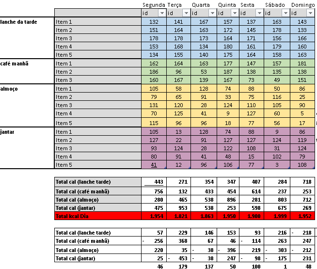
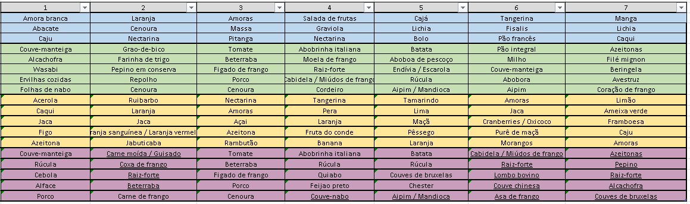
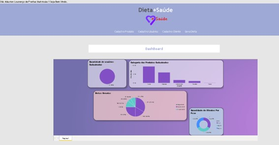

# Ferramenta para geração de dieta, com maximização de combinações possíveis para refeições com restrições e alvo calórico diário.

#### Aluno: [Máurion Lourenço de Freitas](https://github.com/link_do_github)
#### Orientador: [Felipe Borges](https://github.com/FelipeBorgesC)

---

Trabalho apresentado ao curso [BI MASTER](https://ica.puc-rio.ai/bi-master) como pré-requisito para conclusão de curso e obtenção de crédito na disciplina "Projetos de Sistemas Inteligentes de Apoio à Decisão".

- [Link para o código](https://github.com/maurionFreitas/ProjetoFinal---PUC).

---

### Resumo

Com o propósito de se tentar restabelecer o peso ideal com uma dieta hipocalórica (balanceada) com base proposta no Livro “Poder sem limites”, de Tony Robbins, com algumas alterações, me deparei com algumas dificuldades na criação de refeições a dieta proposta.
A dieta proposta por Tony Robbins não prioriza restrições em calorias, mas sim em combinações de alimentos que facilitam a digestão, abaixo algumas premissas que precisam ser atendidas para obtenção de resultado na dieta. 

 - Alvo calórico diário estabelecido (no máximo de 2 mil p/ dia) 
 - 4 refeições diarias com intervalo mínimo de 3 horas entre cada refeição.
 - Não é permitida a ingestão de líquidos durante as refeições.
 - 4 Categorias de alimentos proteínas, carboidratos, vegetais e frutas para composição da dieta.
 - Cada refeição não pode conter carboidratos e proteinas juntos.
 - Já as frutas são a unica categoria permitido no lanche da tarde e não devem estar presentes nas demais refeições.
 - O café da manhã possui permissões adicionais caso a caso, com um campo próprio permitindo ou não.
 - As refeições possuem no minimo 3 e no máximo 5 itens, com exceção para o café da manhã com somente 3 itens na sua composição.
 - Para todas as refeições é necessário que haja no minimo 3 itens distintos.
 - Realizar a dieta por 7 dias (podendo se estender a mais tempo.)
 

### 1. Introdução

A ferramenta tem como objetivo gerar uma dieta proposta, tendo em vista a diversificação de alimentos, não sendo sempre carboidrato ou sempre proteina, somando as 4 refeições dirária não podendo ultrapassar os 2 mil kcal por dia, respeitando as restrições e podendo ter um grande resultado, com base nos produtos cadastrados via sistema (tela de cadastro de produtos), tendo uma tela de cadastro de pessoa para acompanhamento do processo, com o objetivo de calcular o IMC e assim informando o peso ideal e o necessário de peso a perder, contando com uma tela de geração de Dieta e também uma Dashboard para ser feito o acompanhamento dos resultados.

### 2. Modelagem

 - Foram cadastrados uma lista com 190 produtos, no sistema via tela de cadastro em PHP, indexados e com a quantidade de calorias, porções, categoria (proteínas, carboidratos, frutas ou vegetais) e se são permitidos ou não no café da manhã. Os alimentos e quantidades de calorias foram obtidas por pesquisa (https://www.chi.pt/tabela-de-calorias.htm) e (https://www.tabeladecalorias.net/).

.

 - Após o cadastro dos Produtos podemos gerar a dieta através da ferramenta PDI Pentaho que foi criado um algoritimo para a geração da dieta.
No PDI Pentaho foi filtrado as refeições café, lanche da tarde, almoço e janta, com o Intuito de ajustar melhor os filtros para cada condição, no café da manhã filtramos apenas produtos com flag igual a 1, no Almoço/Janta utilizamos um filtro retirando esses alimentos, lanche da tarde filtramos apenas frutas,
ao final o algoritimo verifica a kcal se está entre 1800 a 2000, caso não esteja ele volta e refaz, criando as refeições dia a dia, cria para 7 dias, ao ter atendido as condições, o valor máximo de kcal e gerado o ultimo dia, é gravado em uma tabela do banco, tabela tbtempdiasdieta.

 - Foi criado no Excel uma tabela para cada uma das 4 refeições diárias, com as respectivas quantidades de itens (em linhas) e com os 7 dias da semana (em coluna) isso para podermos validar o algoritmo, valido apenas entre 1800 a 2000 diaria.

.

 - Abaixo de cada tabela de cada refeição, foi criada uma fórmula com o retorno binário (0 para false ou 1 para true) conforme as restrições imposta para cada caso. Ao final da Dieta verificamos o valor de caloria gerada.
 
 - No excel foi feita uma integração com o banco de dados onde o mesmo pega as informações dos produtos gerados no banco pelo PDI, já faz a validação conforme informado e em outra tela já mostra a Dieta gerada com o nome dos produtos e dias.
 
 .

 - Voltando ao PHP, também foi desenvolvido uma tela com integração para o PDI, executando um comando onde é chamado o PDI via CMD, que faz a chamada do PDI via .bat, assim iniciando o processo de geração de dieta pelo PHP, que ao termino é exibido uma mensagem no sistema informando o término.
 
 - No PHP também foi feita uma integração com o Power BI, onde foi feito uma tela no Power BI que pega os valores via banco, no PHP foi inserido esse frame do Power BI, assim tendo a visão do Dashboard dentro do sistema em PHP, como imagem abaixo.
 
 .

### 3. Resultados

Os resultados obtidos foram ótimos, cada refeição seguindo as restrições imposta pelo problema, não ultrapassando o total por refeição de 2000 kcal diario, tendo as 4 refeições diárias, seguindo as 4 Categorias de alimentos proteínas, carboidratos, vegetais e frutas para composição da dieta, gerando refeições que não combinem carboidrato x proteina, lanche da tarde somente com frutas, café da manhã sendo gerado a partir da coluna que term permissão ou não para o café da manhã, refeições possuindo 3 itens no minimo e no máximo 5 (exceto café que tem minimo de 3), e sendo realizado 7 dias.
Em todos os testes foi obtido as restrições impostas, não tendo nenhuma mudança no cenário ou sendo preciso algum tipo de alteração ou modificação após a versão final.

### 4. Conclusões

Após a análise e testes ao longo do desenvolvimento, é fato que existe diversas possibilidades de desenvolvimento para teste deste tipo de problema, conforme o desenvolvimento da aplicação pude verificar que o problema alvo sendo o valor de 2000 kcal diária foi no que pude ter o melhor resultado, porém utilizando um calculo que podemos encontrar dentro de cada refeição um valor de 1800 entre 2000 mil kcal,sendo assim gerando uma refeição diária com itens distintos e que contém proteína ou carboidratos na mesma refeição, atendendo as restrições impostas pelo problema, tendo em vista o resultado, a dieta é para seguir os 7 dias da semana podendo se estender a mais tempo.
Entendo que para obter um certo resultado é recomendável manter a dieta por no mínimo 1 mês.

---

Matrícula: 202.190.281

Pontifícia Universidade Católica do Rio de Janeiro

Curso de Pós Graduação *Business Intelligence Master*
